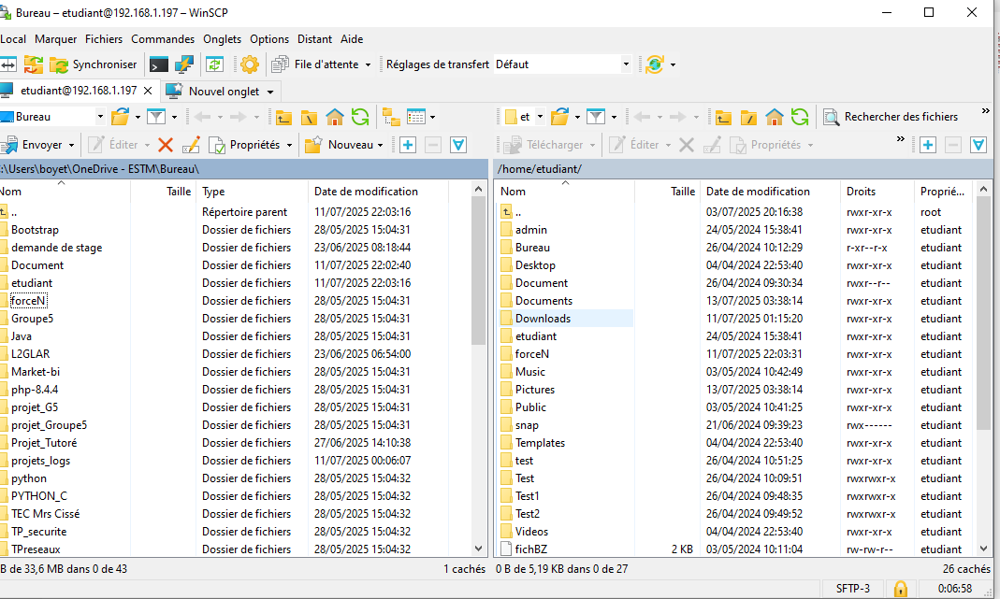
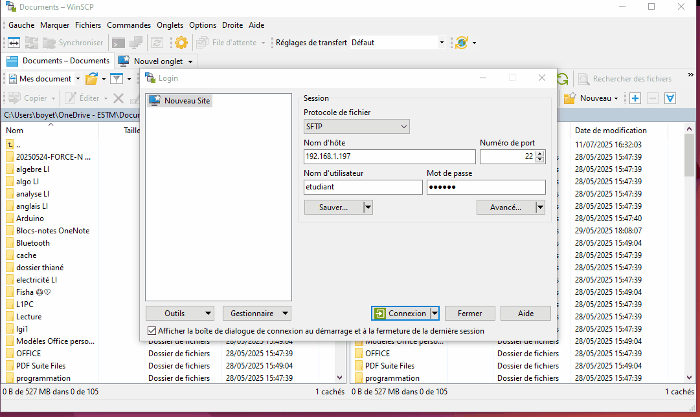

# 🔐 Projet 07 – Tutoriel SSH + WinSCP

### 📝 Description :
Tutoriel complet pour installer SSH sur Ubuntu, configurer WinSCP sur Windows et effectuer des transferts de fichiers sécurisés entre les deux systèmes.

### 🖼️ Image :

### 🎞️ GIF démonstration :

### 🎥 Vidéo (sans son) :
📽️ [Voir la vidéo](https://drive.google.com/file/d/1yMXTu_xNuj40jspSzVkXfGv5h7pdJkWx/view?usp=sharing&t=3)

### 🔗 Lien GitHub :
[https://github.com/tbyb/tutoriel-ssh-winscp](https://github.com/tbyb/tutoriel-ssh-winscp)

### 🛠️ Technologies utilisées :
- OpenSSH Server (Ubuntu)
- WinSCP (Windows)
- SCP/SFTP via réseau local
